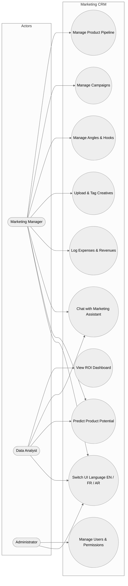
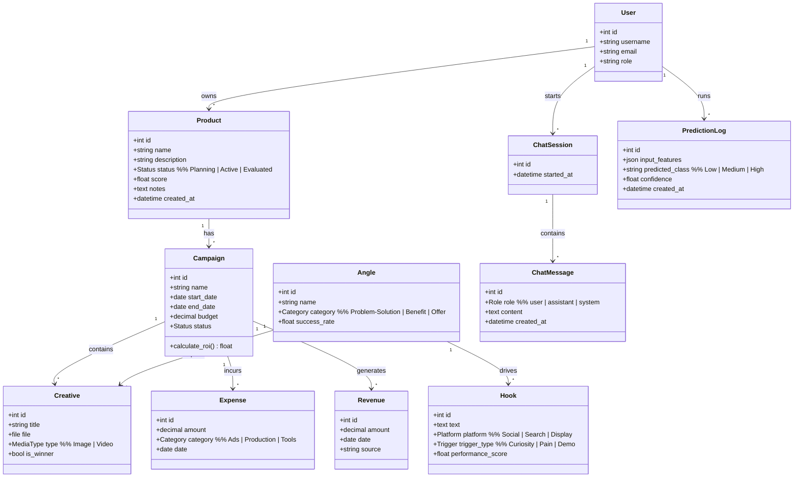
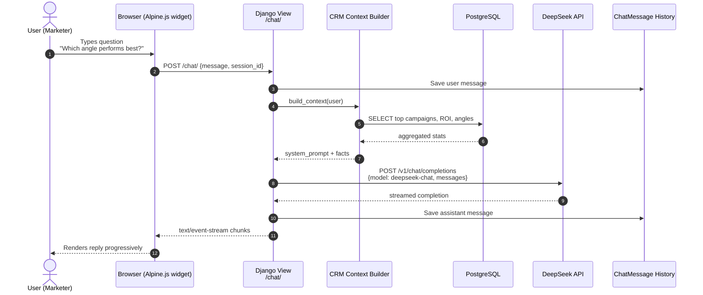
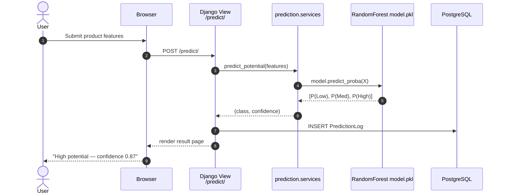
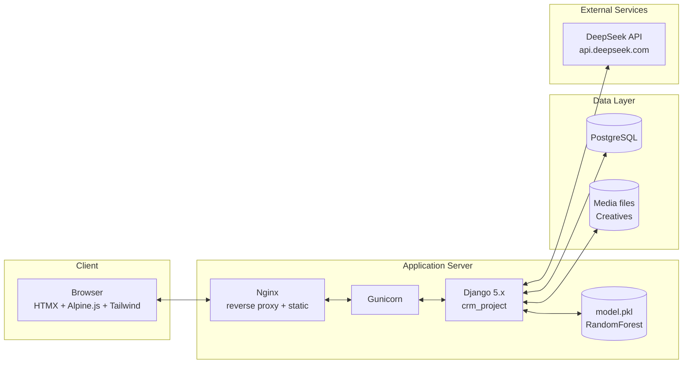
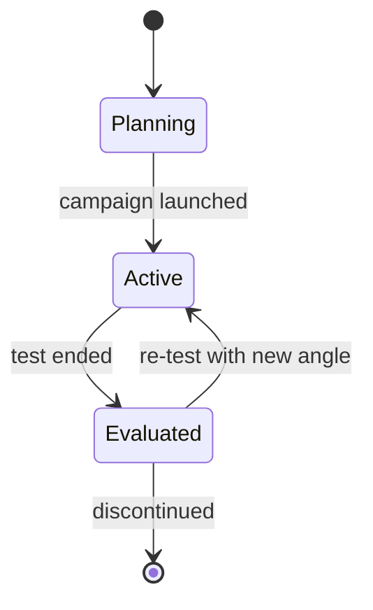

# UML Diagrams — Marketing Campaign & Asset Management CRM

All diagrams are written in [Mermaid](https://mermaid.js.org/) syntax. They render
natively on GitHub, GitLab, VS Code, and most Markdown viewers. They can also be
exported to PNG/SVG (via `mmdc`, the Mermaid CLI) for inclusion in the LaTeX
report.

---

## 1. Use-Case Diagram

Captures the main actors of the platform and the business actions they can
perform. The DeepSeek **Marketing Assistant** chatbot is treated as a first-class
use case because it is a key differentiator of the project.

---

## 2. Class Diagram (Domain Model)

Describes the persistent data model behind the CRM. Each class becomes a Django
model in the corresponding app (`pipeline`, `assets`, `finance`, `chatbot`,
`prediction`).

---

## 3. Sequence Diagram — DeepSeek Chatbot Flow

This diagram traces the full lifecycle of a single user message through the
chatbot plugin. It demonstrates how the Django backend enriches the prompt with
**live CRM context** (top campaigns, recent ROI, best angle) before forwarding
it to the DeepSeek API.

---

## 4. Sequence Diagram — Product Potential Prediction

Shows how the ML bonus feature is invoked (either directly via a form, or
indirectly by the chatbot when asked "Should I launch this product?").

---

## 5. Deployment / Component Diagram

Production-style topology. For the academic demo we run everything on
`localhost`, but the report describes the target deployment.

---

## 6. Activity Diagram — Campaign Lifecycle

Shows the Kanban-style flow of a product through the pipeline, used to motivate
the `Status` enum on the `Product` model.

